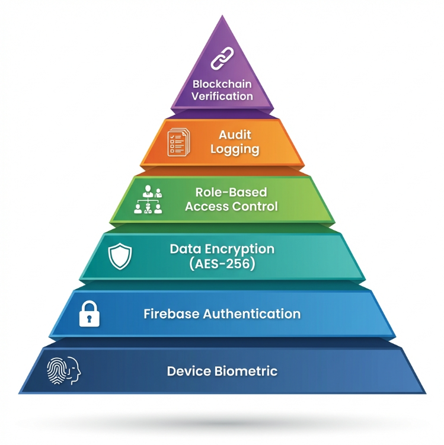

# ChainCare - Secure Medical Record Management

A mobile health vault with biometric security, QR-based access control, and blockchain audit trails.

## 📋 Problem Statement

Patients lack control over their medical data, and there's no transparent way to track who accessed their records and when.


*Role-based portal selection: Patient, Doctor, or Emergency Access*

## 💡 Solution

ChainCare is a Flutter mobile application that gives patients full control over their medical records through multi-layer security:

1. **Biometric Authentication** - Fingerprint/Face ID app lock with AES-256 encryption
2. **QR-Based Access Control** - Patients generate temporary QR codes for doctors to scan
3. **Blockchain Audit Trail** - Every access event logged immutably on Polygon blockchain
4. **AI Clinical Assistant** - Google Gemini integration for medical history summarization


*Multi-layer security architecture from device biometrics to blockchain verification*

## 📱 Screenshots

### Patient Dashboard

*Patient dashboard with quick actions: Medical ID QR, Records, AI Assistant, Access Logs*

### Access Transparency Log

*Real-time audit trail showing who accessed records, when, and from which facility*

### Doctor Workspace

*Doctor dashboard with QR scanner for patient consent and record access*

### Blockchain Verification

*Blockchain-verified audit trail with Merkle root hashes posted to Polygon testnet*

## 🛠️ Tech Stack

- **Frontend:** Flutter (Dart)
- **Backend:** Firebase (Auth, Firestore, Cloud Functions), Node.js
- **Blockchain:** Solidity, Polygon (Mumbai Testnet)
- **AI:** Google Gemini 2.0 (RAG architecture)
- **Security:** AES-256 encryption, local_auth (biometrics), SHA-256 hashing

### System Architecture

*Full-stack integration: Flutter app ↔ Firebase backend ↔ Polygon blockchain ↔ Gemini AI*

## ✨ Key Features

- Multi-factor authentication (Email, Google OAuth, Phone OTP)
- Platform-native biometric app lock (iOS Face ID, Android Fingerprint)
- Role-based access control (Patient, Doctor, Admin)
- Medical record upload with OCR text extraction (ML Kit)
- Time-limited QR code generation for doctor access
- Merkle tree-based blockchain logging (99% gas cost reduction)
- AI-powered patient history summarization

### QR-Based Consent Flow

*Patient generates QR → Doctor scans → System creates audit log → Access recorded on blockchain*

## 👥 Team Project - My Contribution

This was a **4-person final-year project**. I developed the **Authentication & User Management Module**, including:

- Firebase Authentication integration (Email/Password, Google Sign-In, Phone OTP)
- Biometric app lock using Flutter's `local_auth` package
- Platform channels for native biometric hardware integration (iOS Secure Enclave, Android Keystore)
- Role-based routing and session management
- User profile screens (health data, allergies, medications)
- Doctor credential verification flow

**Other modules** (blockchain integration, medical records, AI assistant) were developed by teammates.

### AI Assistant Architecture (Built by teammate)

*Retrieval-Augmented Generation: Patient records → Context builder → Gemini AI → Clinical insights*

## 📂 Project Structure
```
lib/
├── app/                    # App-level logic
│   ├── auth_gate.dart      # Role-based routing
│   └── app_lock_gate.dart  # Biometric lock
├── services/               # Backend services
│   ├── auth_service.dart   # Firebase Auth
│   └── ...
├── screens/                # UI screens
│   ├── patient_auth/       # Patient login/signup
│   ├── doctor_auth/        # Doctor login
│   └── patient_profile_screen.dart
└── ...
```

## 🚀 Setup Instructions

### Prerequisites
- Flutter SDK (3.0+)
- Firebase account
- Android Studio / VS Code

### Installation

1. Clone the repository
```bash
git clone https://github.com/shehabinsinad/ChainCare.git
cd ChainCare
```

2. Install dependencies
```bash
flutter pub get
```

3. Configure Firebase
- Add `google-services.json` (Android) and `GoogleService-Info.plist` (iOS)
- Update Firebase project settings in `lib/firebase_options.dart`

4. Run the app
```bash
flutter run
```

## 📝 Learning Outcomes

This project taught me:
- Building production-ready authentication systems with multiple auth providers
- Platform-native integration using Flutter platform channels
- Managing app lifecycle for biometric security
- Working with Firebase backend services
- Collaborating on a large codebase with team members using Git

## 📄 License

This project was developed as an academic final-year project at MES College of Engineering.

## 🙏 Acknowledgments

Developed by a team of 4 students as our final-year B.Tech project (2024-2025).
